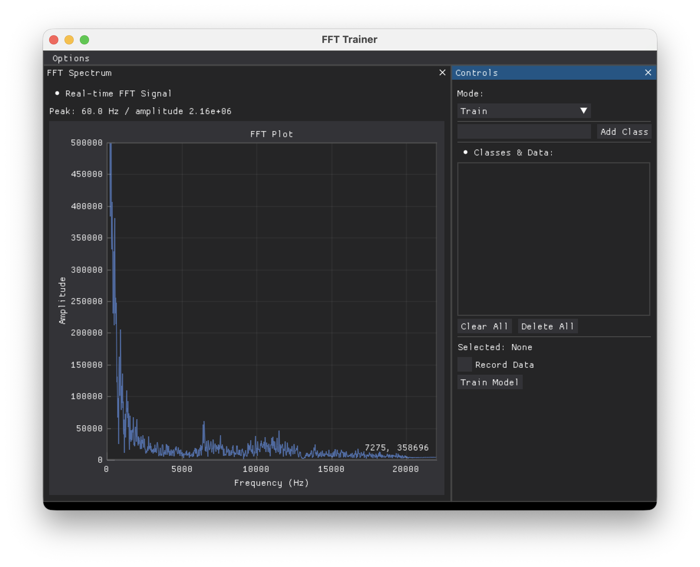

# Vibration Based Interactions Project

This project provides a real-time FFT visualizer for microphone vibration or audio input. It reads laptop microphone data, computes the Fast Fourier Transform, and displays frequency on the x axis with FFT amplitude on the y axis. The same captured FFT amplitude data can be recorded into classes, used to train a model, and then used for live inference.

## Installation

### Mac Setup

Install PortAudio with [Homebrew](https://brew.sh/):

```bash
brew install portaudio
```

## System Setup

Clone this repository and enter the project directory:

```bash
git clone https://github.com/hilab-open-source/vibration-interaction-bake-off.git
cd vibration-interaction-bake-off
```

We recommend using [uv](https://docs.astral.sh/uv/) for package management.

### uv

Install uv, then run:

```bash
uv sync
```

### Pip

Use Python 3.10 and create a virtual environment:

```bash
python3.10 -m venv .venv
. .venv/bin/activate
pip install .
```

## Usage

### Starting Up

With uv:

```bash
uv run visualizer.py
```

With pip:

```bash
. .venv/bin/activate
python visualizer.py
```

### The Visualizer



The visualizer uses the laptop microphone when available. The plot shows the FFT spectrum of the live microphone signal, with frequency in Hz on the x axis and amplitude on the y axis. The y axis is fixed at a maximum amplitude of `500000` so changes in sound level are easier to compare over time. A live peak readout above the plot shows the strongest frequency and its current amplitude.

On the right, the training panel lets you add classes, select a target class, and record FFT amplitude samples into that class. After collecting data for at least two classes, use **Train Model** to train the selected model.

Switching to **Infer** lets you save or load a trained model and view live predictions from the incoming FFT data.

## Modifying

Most project-specific changes should be made in [`models.py`](models.py). That file contains the interfaces for retrieving audio features, preprocessing captured data, training a model, making predictions, and saving or loading trained models.

## Contributing

Please report issues through GitHub. If you would like to contribute, fork the repository and open a pull request.

## Acknowledgements

This project was created as a part of UCLA's EC ENGR 209AS Designing Interactive Systems and the Los Angeles Computing Circle's curriculum.

## License

This project is licensed under the [MIT License](LICENSE).
